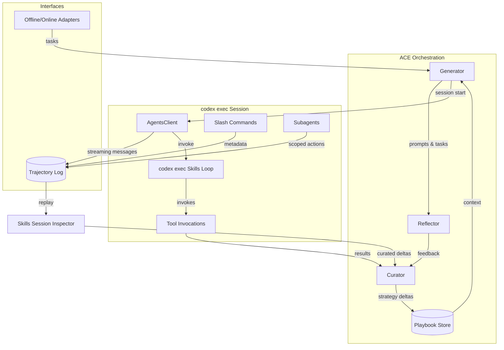
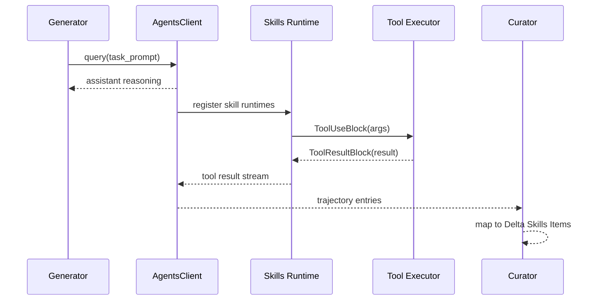
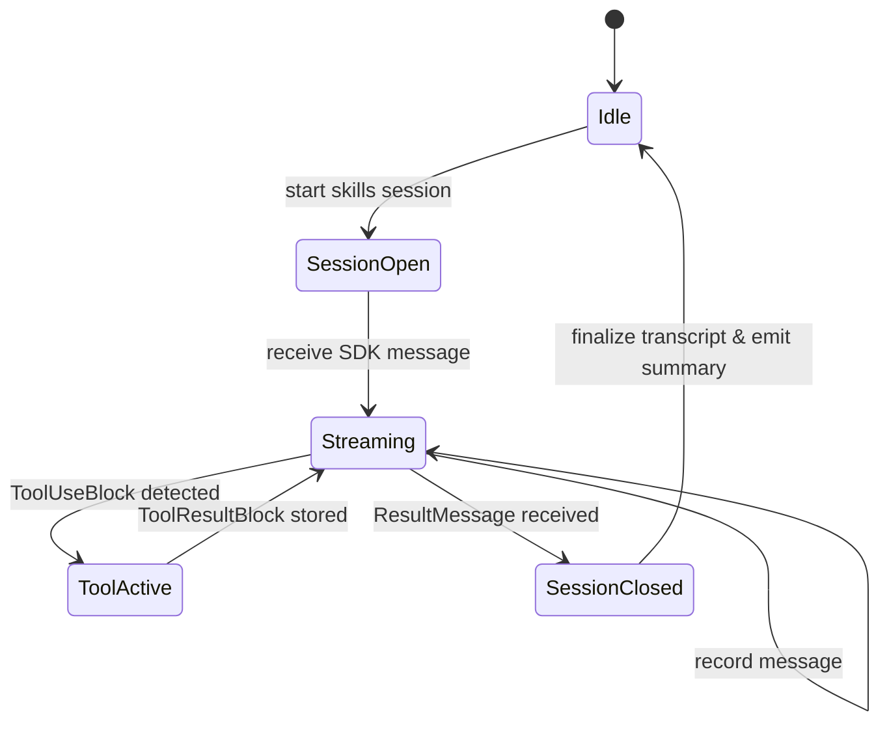

# Specification: ACE Skills Sub-loop with codex exec Integration

## Background and Current Capabilities
- ACE orchestrates the Generator, Reflector, and Curator roles through the existing `OfflineAdapter`/`OnlineAdapter` abstractions, persisting strategies in a playbook and supporting Anthropic models via `LiteLLMClient`.
- Experiments confirm that the tri-agent adaptation loop materially improves downstream quality when tasks and models leave headroom for learning.
- The proposed codex exec detour introduces a `/openai/skills` loop between task generation and trajectory review. The specification below grounds each step of that detour in documented codex exec primitives so the same executable powers every workflow-embedded agent.

## Goals
1. Embed a codex exec-driven "Skills Loop" inside the ACE trajectory review so that task deltas can invoke Codex Exec-powered skills during reflection and curation.
2. Extend ACE's task trajectory logging with executable-native slash commands, subagents, and skill invocations while preserving current playbook semantics.
3. Keep the design ready for both offline (batch) and online (live) adapters without breaking existing flows.

## Typed Data Model (Pydantic-first)
Strongly typed schemas ground the skills loop in predictable contracts that both SDK adapters and inspectors can share. All models below inherit from `pydantic.BaseModel` and default to `model_config = ConfigDict(extra="forbid")` to guard against drift.

```python
from __future__ import annotations

from datetime import datetime
from typing import Literal, Optional

from pydantic import BaseModel, ConfigDict, Field, HttpUrl


PermissionMode = Literal["plan", "acceptEdits", "bypassPermissions"]


class SkillDescriptor(BaseModel):
    model_config = ConfigDict(extra="forbid")

    name: str = Field(description="Unique skill slug used by slash commands.")
    version: str = Field(description="Semver string tracked in the registry.")
    description: str = Field(description="Human-readable summary of the skill.")
    entrypoint: str = Field(description="Dotted path to the callable bound by @tool.")
    allowed_tools: list[str] = Field(default_factory=list, description="Subset of tools exposed by the skills runtime.")


class AgentSessionConfig(BaseModel):
    model_config = ConfigDict(extra="forbid")

    model: Literal["gpt-5", "gpt-4o"] = Field(description="Reasoning model for non-coding phases.")
    codex_tools_enabled: bool = Field(description="Whether Codex Exec-backed tools are permitted.")
    permission_mode: PermissionMode = Field(description="SDK permission level.")
    fork_session: bool = Field(default=False, description="Enable trajectory branching for experiments.")


class SkillOutcome(BaseModel):
    model_config = ConfigDict(extra="forbid")

    skill_name: str
    started_at: datetime
    finished_at: datetime
    result_summary: str
    permission_mode: PermissionMode
    stderr_present: bool
    artifact_paths: list[str] = Field(default_factory=list)


class TranscriptEvent(BaseModel):
    model_config = ConfigDict(extra="forbid")

    event_type: Literal[
        "assistant_message",
        "user_message",
        "tool_use_block",
        "tool_result_block",
        "slash_command",
        "subagent_stop",
    ]
    timestamp: datetime
    session_id: str
    task_id: str
    payload: dict
    thinking_snippet: Optional[str] = Field(default=None, description="Redacted thinking tokens when available.")


class SkillsLoopConfig(BaseModel):
    model_config = ConfigDict(extra="forbid")

    enabled: bool = Field(description="Feature flag for the skills loop.")
    registry: list[SkillDescriptor]
    session: AgentSessionConfig
    hook_logging: bool = Field(default=True, description="Whether to persist hook events to JSONL transcripts.")
    coverage_thresholds: dict[str, float] = Field(
        default_factory=lambda: {"branch": 0.8, "lines": 0.85},
        description="Required coverage ratios for automated tests.",
    )
```

The `SkillDescriptor` and `SkillsLoopConfig` objects become the single source of truth for adapter wiring, CLI flag parsing, and inspector validation. Concrete SDK adapters should only accept these Pydantic models to ensure cross-module consistency.

## Non-goals
- Replacing ACE's Generator/Reflector/Curator prompts.
- Building new evaluation environments.
- Shipping production slash-command libraries beyond what codex exec already exposes.

## Architectural Overview
| Diagram Element | Proposed Implementation |
| --- | --- |
| **Context Playbook / Delta Playbook Items** | Maintain as the canonical ACE playbook. New SDK metadata captured during skills runs becomes structured deltas merged via existing curator logic. |
| **TASK Query / TASK Generator** | Wrap the current Generator call so that prompts are issued through the codex exec executable sessions, enabling interactive skill usage instead of simple completions. |
| **TASK Trajectory + TASK STUBER** | Stream executable messages (assistant, tool-use, result) into ACE's trajectory log. We will create ACE-native "task stubs" from incoming slash-command or subagent events and persist them alongside reasoning text. |
| **SKILL Query / SKILL Gallery** | Drive the `/openai/skills` loop by configuring codex exec skill packs built with the executable's tool helpers and wiring them into `AgentOptions.allowed_tools`. |
| **Delta Skills Items** | Summaries of accepted/rejected skill invocations become structured artifacts that the Curator emits as playbook deltas in addition to traditional textual strategies. |
| **Delta Trajectory Inspector** | Consume JSONL transcripts (task + skill) to render the combined stream for replay and curation, ensuring that every skills-loop event is visible to the reflector/curator path. |

### Information Flow Coverage (image parity)
The annotated diagram introduces several pathways that were only implicit before. The following dataflows must be implemented to keep the skills builder faithful to that diagram:

1. **Delta intake → Skills Loop**
   - The curator selects a pending delta (or playbook gap) and forwards a `DeltaInput` record into the skills loop through the Generator wrapper. The record contains the delta id, rationale, and the originating playbook section so the plan/build/test steps know where to apply edits.
   - `AgentOptions` receives this `DeltaInput` as part of the system prompt, and the initial `query()` call emits a `TaskStub` entry tagged `source=delta` so the trajectory shows which delta was targeted.

2. **Skill loop entry/exit wiring**
   - The **enter SKILL LOOP** hop in the diagram maps to a dedicated `enter_skill_loop()` helper in `ace/integrations/codex_exec.py`. It seeds the skills tool stack, captures `get_server_info()` metadata (slash commands + subagents), and writes a `SkillsSessionOpened` transcript header that ties subsequent tool runs back to the originating task id.
   - The **Delta Output** arrow is realized by converting accepted `SkillOutcome` records into `DeltaSkillsItem` structures. These are appended to both the trajectory (`phase=review`) and to the curated playbook delta log so the next ACE run can rehydrate them.

3. **Task stubber ↔ inspector feedback**
   - When the diagram shows the TASK STUBER and Delta Trajectory Inspector connected, mirror each slash command, tool start/finish, and subagent stop into the JSONL transcript with a `stub_ref` pointing to the originating delta/task. The inspector consumes these references to reconstruct the ordered stream (task reasoning → skill invocations → curator decisions) and to render the state machine in the image (PLAN → BUILD → TEST → REVIEW → DOCUMENT).
   - Any missing metadata (e.g., test artifact paths, permission escalations) must be backfilled before closing the skills session so the inspector can draw the full pathway without guessing.

4. **Loop lifecycle and retries**
   - The Plan/Build/Test/Review/Document state machine in the image is enforced by tagging each transcript event with `phase` and emitting explicit `PhaseTransition` records. Failed BUILD or TEST steps loop back to PLAN with a `retry_count` increment and the prior tool stderr attached. Curators can then see that a retry happened, matching the diagram's branching arrows.
   - The loop closes only after the DOCUMENT phase emits a `DeltaOutputFinalized` record tying the curated delta to the updated playbook section. This guarantees the outward arrows (to Delta Playbook and Task Trajectory) have concrete payloads.

### Skills Builder Module Directory Guidance
To keep the skills loop maintainable and discoverable, the skills builder module should mirror the runtime flow with descriptive sub-directories and clear entry points for both humans and agents:

- `ace/skills_builder/README.md` — Top-level explainer that links to the sections below and documents the contract for building and publishing skills.
- `ace/skills_builder/registry/` — Source of truth for skill metadata, schemas, and versioned descriptors used by the playbook-to-tool compiler.
- `ace/skills_builder/runtimes/` — Houses skill runtime factories that wrap registered skills with codex exec helpers; the runtime agent imports from here when wiring `AgentOptions`.
- `ace/skills_builder/adapters/` — Shims that connect ACE abstractions (playbooks, trajectories) to codex exec constructs (`AgentOptions`, `HookMatcher`, `AgentsClient`).
- `ace/skills_builder/session_entrypoints/` — Developer- and agent-friendly entry points, including:
  - `dev_cli.py`: CLI for scaffolding skills, previewing tool wiring, and running local smoke tests.
  - `agent_runtime.py`: Thin wrapper that receives task prompts and initializes the AgentsClient plus skills runtime; this is the import target for runtime agents.
- `ace/skills_builder/examples/` — Minimal, runnable skills that demonstrate idiomatic `@tool` usage and telemetry hooks.
- `ace/skills_builder/tests/` — Contract tests that assert registry consistency, skills runtime startup, and adapter integration.

This layout gives developers a documented on-ramp (`README.md`, `dev_cli.py`) and gives runtime agents deterministic import targets (`agent_runtime.py`, `runtimes/`) that align with the skills loop diagrams above.

## System Diagrams

### Overall ACE Application with codex exec Integration


### codex exec Skills Sub-loop


### Observability Flow (Non-Temporal)
```mermaid
graph LR
    Hooks[codex exec Hooks\n(UserPromptSubmit, ToolStart, SubagentStop)] --> Recorder[ACE Event Recorder]
    Recorder --> JSONL[(JSONL Transcript Store)]
    Recorder --> Metrics[(Telemetry Aggregator)]
    Metrics --> Dashboards[Inspector Metrics Overlay]
    JSONL --> InspectorUI[Skills Session Inspector]
    InspectorUI --> PlaybookDelta[Exported Deltas]
```

### Logging and Transcript Capture


## Key codex exec Touchpoints

### 1. Session & Streaming Control
- Use `AgentsClient` for each ACE generator call so that we can send follow-up prompts, inspect tool usage, and fetch slash-command metadata via `get_server_info()`.
- For one-shot probes (e.g., skill validation without a full chat), fall back to `query()`.
- Default non-coding reasoning (planning, reflection, curation, documentation) to the `gpt-5` model while routing executable build/test steps through Codex Exec-backed tools for isolated code changes.

```python
# Bidirectional session control (codex exec docstring for AgentsClient.set_permission_mode)
async with AgentsClient() as client:
    await client.query("Help me analyze this codebase")
    await client.set_permission_mode('acceptEdits')
    await client.query("Now implement the fix we discussed")
```

```python
# One-off streaming query (codex exec docstring for query)
async for message in query(
    prompt="Create a Python web server",
    options=AgentOptions(
        system_prompt="You are an expert Python developer",
        cwd="/home/user/project",
    ),
):
    print(message)
```

### 2. Skills Integration
- Define ACE-managed tools with the executable's `@tool` decorator and register them directly with the skills runtime. These tools expose existing ACE utilities (e.g., playbook diffing, context fetchers) to Codex Exec during task reflection.

```python
# codex exec docstring for tool()
@tool("add", "Add two numbers", {"a": float, "b": float})
async def add_numbers(args):
    result = args["a"] + args["b"]
    return {"content": [{"type": "text", "text": f"Result: {result}"}]}

options = AgentOptions(
    tools=[add_numbers],
    allowed_tools=["add"],
)
```

- Map each skill invocation to an ACE delta:
  - On `ToolUseBlock`, capture tool name, inputs, and subsequent `ToolResultBlock` content.
  - When the curator accepts/rejects a skill outcome, translate it into "Delta Skills Items" synchronized with the playbook.

### 3. Slash Commands & Subagents
- Call `AgentsClient.get_server_info()` once per session to enumerate server-provided slash commands and present them as ACE "task stubs." Each stub records command metadata so curators can trace which interventions were available.
- Use `AgentOptions.agents` with documented `AgentDefinition` to preload role-specific subagents (e.g., "Skills Curator," "Trajectory Auditor"). Hook into `SubagentStop` events through the existing hook API (`HookEvent`/`HookMatcher`) to log subagent contributions and terminate sessions cleanly when the diagram's "SKILL Gallery" loop completes.
- Enable session forking via `AgentOptions.fork_session` for experiments that branch the trajectory when the skills loop diverges.

### 4. Hooks, Permissions, and Observability
- Register `HookEvent.UserPromptSubmit` and `HookEvent.SubagentStop` callbacks so that ACE can:
  1. Mirror each slash-command invocation into the trajectory log before execution.
  2. Collect completion statistics and raw SDK telemetry for curator analysis.
- Permissioning: start in `permission_mode="plan"` (safe defaults) and escalate to `acceptEdits` or `bypassPermissions` only inside curated loops, mirroring the documented capability toggles.
- Emit structured telemetry (session id, slash command used, tool success/failure) for ACE's evaluation harness.

## Detailed Implementation Plan

All adapter entrypoints and CLI surfaces should consume the Pydantic models above. This ensures the executable wrapper, skills registry, and inspector serialize/deserialize the same `SkillsLoopConfig` payload without bespoke dict plumbing.

1. **Integration Surface (`ace/integrations/codex_exec.py`)**
   - Create a wrapper around `AgentsClient` providing convenience async methods:
     - `run_task(prompt, playbook, skills_config) -> TaskTrajectory`.
     - `fetch_server_commands(session) -> list[CommandDescriptor]`.
   - Convert SDK `Message` variants (`AssistantMessage`, `UserMessage`, `ToolUseBlock`, `ResultMessage`) into ACE trajectory entries.

2. **Skills Configuration**
   - Build an `AceSkillRegistry` translating playbook deltas into executable tools using the documented `@tool` decorator pattern.
   - Provide default tools for:
     - Playbook diff inspection.
     - Task stub generation (diagram's "TASK STUBER").
     - External retrieval (optional, behind feature flag).

3. **Task Loop Augmentation**
   - Replace the Generator's direct LLM call with the new codex exec wrapper when the "skills loop" feature flag is enabled. Preserve legacy path as fallback.
   - On each sample:
     1. Start an `AgentsClient` session seeded with ACE system prompt and current playbook summary.
     2. Send the task prompt via `client.query`.
     3. Drain `client.receive_response()`; record assistant reasoning, tool usage, slash commands, and result metadata.
     4. If the SDK yields `ResultMessage`, finalize the trajectory and hand to Reflector.

4. **Skill Gallery Feedback**
   - During reflection, map each `ToolResultBlock` to "Delta Skills Items."
   - Extend `Curator` to read skill deltas and decide whether to promote them to playbook bullets or discard them, ensuring the existing delta operations remain intact.

5. **Slash Commands & Subagents**
   - Immediately after `client.connect()`, call `get_server_info()` to cache slash-command definitions for the session.
   - Support slash-command invocation by capturing user-initiated `UserPromptSubmit` hooks and rewriting them into ACE stubs (diagram's "TASK STUBER").
   - Configure optional `AgentDefinition` entries for specialized subagents (e.g., `/plan`, `/reflect`). Use `HookEvent.SubagentStop` to track when the SDK forks or terminates a subagent loop, recording outcomes as part of the trajectory.

6. **Configuration & Flags**
   - Introduce `CodexExecSkillsConfig` (YAML/JSON) specifying allowed tools, slash commands of interest, and permission escalation rules.
   - Update CLI scripts to load codex exec credentials and enable the integration selectively. CLI loaders should hydrate a `SkillsLoopConfig` instance and refuse to run when validation fails.

7. **Validation & QA (static)**
   - Develop dry-run routines that spin up `AgentsClient` with stub transports (or recorded transcripts) to ensure ACE can parse messages without hitting the live API.
   - Provide documentation updates summarizing the skills loop workflow and configuration knobs.
   - Add `SkillsLoopConfig.model_validate_json()` smoke tests to guarantee future spec edits stay backward compatible.

## Automated Closed Loop: Plan → Build → Test → Review → Document

Embed a first-class, automated development loop that exercises the skills sub-loop end-to-end while producing artifacts ready for curator review.

### Loop Overview
- **Plan**: Use the Generator (via the codex exec wrapper) with the `gpt-5` model to synthesize a task plan from a high-level objective. Persist the plan as a playbook delta and open a `skills` session with `permission_mode="plan"`.
- **Build**: Execute the plan by invoking SDK-managed tools (e.g., playbook diff, retrieval) and slash commands. Coding steps are delegated to Codex Exec so tool-backed code edits run in a controlled sandbox. Capture all tool uses as trajectory entries and provisional "Delta Skills Items." Mark entries with a `phase=build` tag so later analysis can correlate test failures to specific edits.
- **Test**: Prefer `python -m pytest -q --maxfail=1 --disable-warnings --json-report` as the default runner executed via a `run_tests` tool using Codex Exec. Enforce coverage floors (e.g., branch ≥ 80%, lines ≥ 85%) and reuse shared fixtures to avoid environment churn. Record the JSON report path and coverage summary as trajectory artifacts. When suites are prohibitively expensive or external resources are unavailable, fall back to dry-run validators (import smoke tests, schema checks) and annotate the delta with `test_mode=dry_run` so curators can gate promotion. Tests inherit the build session context and reuse cached virtualenvs to minimize latency.
- **Review**: Route the resulting trajectory through the Reflector/Curator using `gpt-5` for non-coding reasoning. Curators accept or reject deltas, including build/test outcomes, turning them into finalized playbook updates. Test artifacts feed curator decisions: failures block Build-tagged deltas, while passing reports raise confidence scores.
- **Document**: Autogenerate a summary from curated deltas (including test status, coverage thresholds, and rationale) with `gpt-5` and append it to the run transcript plus `docs/` release notes for auditability. Surface links to stored pytest JSON reports so inspectors can replay failures.

### Automation Hooks
- Add a `skills_loop_closed_cycle` flag that, when enabled, triggers the loop automatically after the initial plan message, avoiding manual slash commands for each phase.
- Register hook callbacks to checkpoint after each phase:
  - `HookEvent.SubagentStop` or `ResultMessage` for the **Plan** phase (plan artifact captured).
  - `ToolResultBlock` events for the **Build/Test** phases (build logs and test outputs).
  - Curator decision events for the **Review** phase (accepted/rejected deltas).
  - A final transcript writer for the **Document** phase (summary + links to deltas and test artifacts).
- Surface phase progress in the trajectory log (phase tags per entry) so the inspector can render phase timelines and failures clearly.

### Integration Points
- **ace/integrations/codex_exec.py**: extend the wrapper with `run_closed_cycle_task(prompt, playbook, config)` to orchestrate the phase transitions, enforce timeouts, and set `permission_mode` per phase (plan → build → test → review).
- **skills registry**: include a default `run_tests` tool that shells out to `python -m pytest -q --maxfail=1 --disable-warnings --json-report` and aggregates coverage thresholds (branch ≥ 80%, lines ≥ 85%) before emitting a `TestResult` trajectory entry. The tool should reuse fixture caches between invocations and write JSON/coverage artifacts to predictable paths for curator consumption. Provide a configuration knob to downgrade to dry-run validators for costly suites; record the fallback in the delta for transparency.
- **curation**: enhance the Curator to treat phase-tagged deltas specially—e.g., rejecting Build deltas when Test failed—before merging into the playbook. Curators should ingest pytest JSON artifacts to mark deltas as "verified" and surface coverage regressions.
- **documentation**: add a `ClosedCycleSummary` emitter that formats the accepted deltas, test results, permissions escalations, and artifact links into markdown suitable for `docs/` or release notes. Summaries should link trajectory deltas to their originating pytest reports so reviewers can trace failures back to tool runs.

### Observability and Automation Requirements
- **Structured logging**: Emit JSON logs with levels (`DEBUG`, `INFO`, `WARN`, `ERROR`) around all `AgentsClient` hooks and tool executions. Each record includes `session_id`, `permission_mode`, `phase`, `tool_name`, `tool_status`, `stderr_count`, and `curator_visibility=true` to ensure inspector parity.
- **Thinking token exposure**: Capture model thinking tokens in log fields such as `thinking_snippet`, applying masking rules to redact secrets, file paths, and API keys before persistence. Thinking tokens should align with the corresponding trajectory entry id for replay.
- **Stdout/stderr parity**: Route all stderr/exception streams to stdout during tool runs and hook callbacks so transcripts remain complete. Logs must store a `stderr_present` boolean and include truncated stderr payloads with size limits.
- **Reliability controls**: Implement retries with exponential backoff for tool failures (e.g., networked skills runtimes) and a circuit breaker that pauses tool invocations after repeated stderr bursts within a session. Record breaker state and retry counts in logs for curator awareness.
- **Log schema fields**: Standardize fields for curator-visible dashboards—`session_id`, `task_id`, `phase`, `permission_mode`, `hook_event`, `tool_name`, `tool_status`, `duration_ms`, `stderr_count`, `artifact_paths`, and `coverage_delta`. Logs should be stored in JSONL to match transcript storage.

### Acceptance Criteria
- A single CLI invocation (or SDK flag) can drive the full Plan → Build → Test → Review → Document loop without manual prompts between phases.
- Trajectory transcripts show phase-tagged entries, tool invocations, and test outputs, and the inspector can filter by phase.
- Curated deltas from the loop are exportable as playbook patches plus a documentation snippet.

## Risks & Mitigations
- **Executable evolution**: Track codex exec releases; encapsulate all imports in `ace/integrations/codex_exec.py` for easy patching.
- **Tool/permission deadlocks**: Enforce timeouts on tool invocations and default to `permission_mode="plan"` for automation.
- **Telemetry volume**: Because SDK streaming can be verbose, add filters so only relevant tool/slash-command events feed into the playbook deltas.

## Open Questions
1. Should ACE expose a UI for browsing captured slash commands, or is textual logging sufficient?
2. Do we need fallback strategies when `get_server_info()` omits slash commands (older CLI versions)?
3. How should ACE reconcile conflicting skill deltas when multiple subagents modify the same strategy entry?

## Minimal Viable Solution: ACE Skills Session Inspector

### Purpose
Provide a fast, inspectable view of codex exec skill loops that is more informative than raw terminal logs. The inspector highlights tool invocations, slash commands, and subagent hops within an ACE trajectory so curators can replay decisions and extract deltas efficiently.

### User Experience Overview
1. **Launch** the inspector with a single command (`python -m ace.tools.skills_inspector transcript.jsonl`).
2. **Select a trajectory** from the left-side list (per ACE run or task id).
3. **Browse structured panes**:
   - **Timeline Pane**: chronological stream of `AssistantMessage`, `ToolUseBlock`, `ToolResultBlock`, and `SubagentStop` events rendered as collapsible cards.
   - **Context Pane**: current playbook summary, applied deltas, and session metadata.
   - **Skill Detail Pane**: parameters, stdout/stderr, and curator annotations for each tool invocation.
4. **Export** curated deltas back to the playbook as JSON patches.

The UI is built with the [`textual` TUI framework](https://textual.textualize.io/) for minimal dependencies but can be replaced later by a web dashboard.

### Architecture
```
+----------------------+        +---------------------------+
| ACE run (skills loop)|        | docs/transcripts/*.jsonl |
| writes transcript via|        | structured SDK messages   |
| AgentsClient hooks   |-----> | (JSONL storage)           |
+----------------------+        +---------------------------+
           |                                    |
           v                                    v
+----------------------+        +---------------------------+
| skills_inspector CLI |        | Inspector UI widgets      |
| loads transcript ->  |        | - TimelineView            |
| SessionModel         |        | - ContextView             |
+----------------------+        | - SkillDetailView         |
                                +---------------------------+
```

#### Data Model
- **SessionModel**: wraps `AgentsClient` transcripts captured through ACE hooks (`HookEvent.UserPromptSubmit`, `HookEvent.SubagentStop`, `HookEvent.ToolStart`).
- **EventRecord**: normalized schema containing `event_type`, `timestamp`, `sdk_block` payload, and curator tags.
- **SkillOutcome**: derived from `ToolUseBlock` + `ToolResultBlock` pairs, enriched with `permission_mode` and `AgentDefinition` metadata at execution time.

#### Data Source
- Reuse the codex exec streaming callbacks introduced earlier: call `client.get_server_info()` at session start, store the result, and mirror every streamed `Message` into a JSONL transcript. Example hook registration:

```python
from codex_exec.hooks import HookEvent

sdk_client.add_hook(HookEvent.UserPromptSubmit, record_event)
sdk_client.add_hook(HookEvent.ToolStart, record_event)
sdk_client.add_hook(HookEvent.ToolFinish, record_event)
```

Each recorded message is serialized with `Message.model_dump()` so the inspector can faithfully reconstruct the session across a consistent executable.

### CLI Workflow
```bash
python -m ace.tools.skills_inspector docs/transcripts/2024-09-12.jsonl
```

Internally, the CLI:
1. Loads all session entries into `SessionModel` using standard `pydantic` validators from the SDK (`Message`, `ToolUseBlock`, `ToolResultBlock`).
2. Groups events by `session_id` and `task_id`.
3. Boots a Textual application with keyboard shortcuts:
   - `←/→` switch tabs (Timeline / Context / Skill Detail)
   - `s` toggles slash-command filter
   - `e` exports selected skill delta to `ace/playbook_deltas/{session_id}.json`

### Minimal Implementation Steps
1. **Transcript Capture**
   - Extend `ace/integrations/codex_exec.py` to write JSONL transcripts when the skills feature flag is enabled.
   - Ensure we capture `AgentOptions.agents`, `allowed_tools`, and `permission_mode` per session header.

2. **Inspector CLI**
   - Add `ace/tools/skills_inspector.py` implementing:
     - `load_transcript(path)` -> `SessionModel`
     - `SkillInspectorApp` (Textual `App`) with widgets for timeline/context/detail.
     - Export command writing filtered deltas.

3. **Documentation**
   - Document workflow in this specification and link from README once the feature stabilizes.

### Why This Beats Raw Logs
- **Structured filtering**: toggle to view only tool failures, slash commands, or subagent activity.
- **Replay fidelity**: reconstructs the exact order of `AgentsClient` events with metadata, avoiding loss in noisy terminal streams.
- **Curator workflow**: integrates export actions for deltas, letting curators update the playbook without leaving the inspector.
- **Extensible**: we can later add a WebSocket backend or React UI without changing the transcript schema.

### Future Enhancements
- Live mode by tailing an in-progress transcript file (Textual supports async updates).
- Browser dashboard built on the same `SessionModel`.
- Metrics overlay summarizing tool success rates and permission escalations per run.
