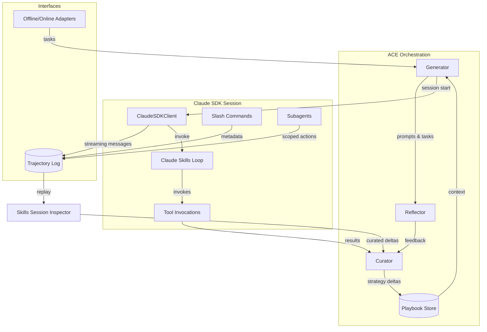
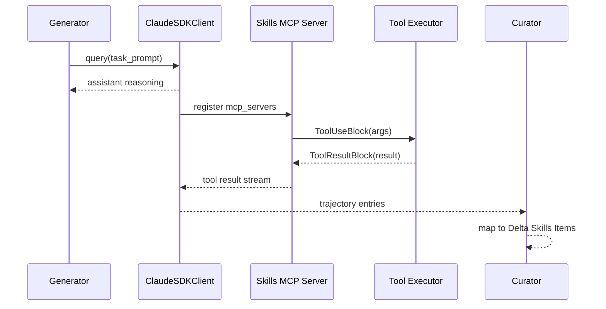
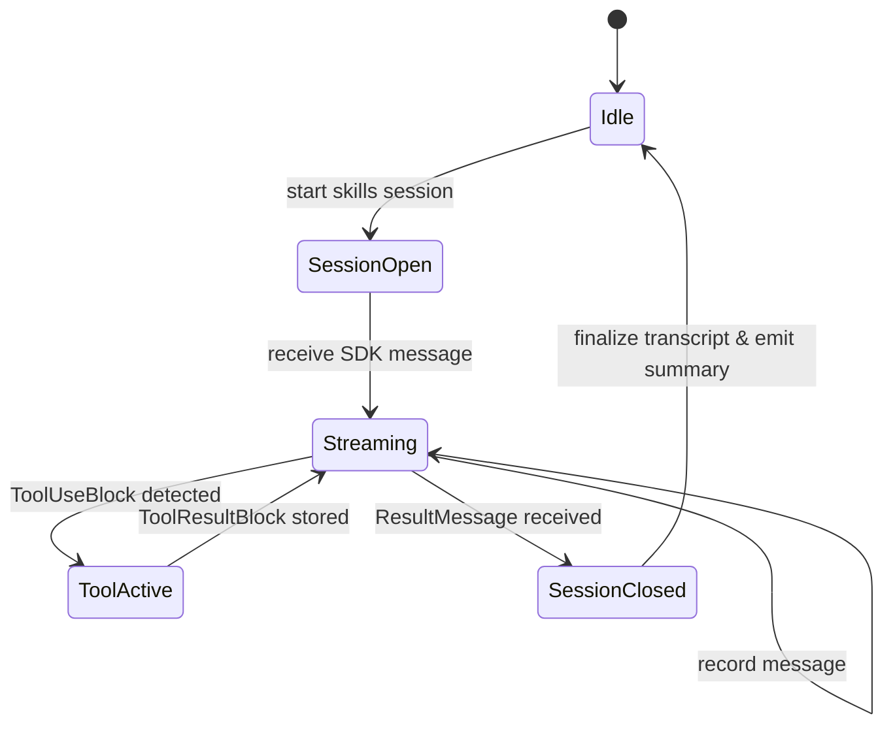

# Specification: ACE Skills Sub-loop with Claude-Agent-SDK Integration

## Background and Current Capabilities
- ACE orchestrates the Generator, Reflector, and Curator roles through the existing `OfflineAdapter`/`OnlineAdapter` abstractions, persisting strategies in a playbook and supporting Anthropic models via `LiteLLMClient`.
- Experiments confirm that the tri-agent adaptation loop materially improves downstream quality when tasks and models leave headroom for learning.
- The proposed Claude Skills detour introduces a `/claude/skills` loop between task generation and trajectory review. The specification below grounds each step of that detour in documented Claude-Agent-SDK primitives.

## Goals
1. Embed a Claude-Agent-SDK driven "Skills Loop" inside the ACE trajectory review so that task deltas can invoke Claude Code skills during reflection and curation.
2. Extend ACE's task trajectory logging with SDK-native slash commands, subagents, and skill invocations while preserving current playbook semantics.
3. Keep the design ready for both offline (batch) and online (live) adapters without breaking existing flows.

## Non-goals
- Replacing ACE's Generator/Reflector/Curator prompts.
- Building new evaluation environments.
- Shipping production slash-command libraries beyond what the Claude-Agent-SDK already exposes.

## Architectural Overview
| Diagram Element | Proposed Implementation |
| --- | --- |
| **Context Playbook / Delta Playbook Items** | Maintain as the canonical ACE playbook. New SDK metadata captured during skills runs becomes structured deltas merged via existing curator logic. |
| **TASK Query / TASK Generator** | Wrap the current Generator call so that prompts are issued through `ClaudeSDKClient` sessions, enabling interactive skill usage instead of simple completions. |
| **TASK Trajectory + TASK STUBER** | Stream SDK messages (assistant, tool-use, result) into ACE's trajectory log. We will create ACE-native "task stubs" from incoming slash-command or subagent events and persist them alongside reasoning text. |
| **SKILL Query / SKILL Gallery** | Drive the `/claude/skills` loop by configuring `ClaudeAgentOptions.mcp_servers` with in-process MCP tools built via the documented `@tool` decorator and `create_sdk_mcp_server` helper. |
| **Delta Skills Items** | Summaries of accepted/rejected skill invocations become structured artifacts that the Curator emits as playbook deltas in addition to traditional textual strategies. |

## System Diagrams

### Overall ACE Application with Claude Skills Integration


### Claude Skills Sub-loop


### Observability Flow (Non-Temporal)
```mermaid
graph LR
    Hooks[Claude SDK Hooks\n(UserPromptSubmit, ToolStart, SubagentStop)] --> Recorder[ACE Event Recorder]
    Recorder --> JSONL[(JSONL Transcript Store)]
    Recorder --> Metrics[(Telemetry Aggregator)]
    Metrics --> Dashboards[Inspector Metrics Overlay]
    JSONL --> InspectorUI[Skills Session Inspector]
    InspectorUI --> PlaybookDelta[Exported Deltas]
```

### Logging and Transcript Capture


## Key Claude-Agent-SDK Touchpoints

### 1. Session & Streaming Control
- Use `ClaudeSDKClient` for each ACE generator call so that we can send follow-up prompts, inspect tool usage, and fetch slash-command metadata via `get_server_info()`.
- For one-shot probes (e.g., skill validation without a full chat), fall back to `query()`.

```python
# Bidirectional session control (Claude Agent SDK docstring for ClaudeSDKClient.set_permission_mode)
async with ClaudeSDKClient() as client:
    await client.query("Help me analyze this codebase")
    await client.set_permission_mode('acceptEdits')
    await client.query("Now implement the fix we discussed")
```

```python
# One-off streaming query (Claude Agent SDK docstring for query)
async for message in query(
    prompt="Create a Python web server",
    options=ClaudeAgentOptions(
        system_prompt="You are an expert Python developer",
        cwd="/home/user/project",
    ),
):
    print(message)
```

### 2. Skills Integration
- Define ACE-managed tools with the SDK's `@tool` decorator and bundle them via `create_sdk_mcp_server`. These tools expose existing ACE utilities (e.g., playbook diffing, context fetchers) to Claude Code during task reflection.

```python
# Claude Agent SDK docstring for tool() / create_sdk_mcp_server()
@tool("add", "Add two numbers", {"a": float, "b": float})
async def add_numbers(args):
    result = args["a"] + args["b"]
    return {"content": [{"type": "text", "text": f"Result: {result}"}]}

calculator = create_sdk_mcp_server(
    name="calculator",
    version="2.0.0",
    tools=[add_numbers],
)
options = ClaudeAgentOptions(
    mcp_servers={"calc": calculator},
    allowed_tools=["add"],
)
```

- Map each skill invocation to an ACE delta:
  - On `ToolUseBlock`, capture tool name, inputs, and subsequent `ToolResultBlock` content.
  - When the curator accepts/rejects a skill outcome, translate it into "Delta Skills Items" synchronized with the playbook.

### 3. Slash Commands & Subagents
- Call `ClaudeSDKClient.get_server_info()` once per session to enumerate server-provided slash commands and present them as ACE "task stubs." Each stub records command metadata so curators can trace which interventions were available.
- Use `ClaudeAgentOptions.agents` with documented `AgentDefinition` to preload role-specific subagents (e.g., "Skills Curator," "Trajectory Auditor"). Hook into `SubagentStop` events through the existing hook API (`HookEvent`/`HookMatcher`) to log subagent contributions and terminate sessions cleanly when the diagram's "SKILL Gallery" loop completes.
- Enable session forking via `ClaudeAgentOptions.fork_session` for experiments that branch the trajectory when the skills loop diverges.

### 4. Hooks, Permissions, and Observability
- Register `HookEvent.UserPromptSubmit` and `HookEvent.SubagentStop` callbacks so that ACE can:
  1. Mirror each slash-command invocation into the trajectory log before execution.
  2. Collect completion statistics and raw SDK telemetry for curator analysis.
- Permissioning: start in `permission_mode="plan"` (safe defaults) and escalate to `acceptEdits` or `bypassPermissions` only inside curated loops, mirroring the documented capability toggles.
- Emit structured telemetry (session id, slash command used, tool success/failure) for ACE's evaluation harness.

## Detailed Implementation Plan

1. **Integration Surface (`ace/integrations/claude_sdk.py`)**
   - Create a wrapper around `ClaudeSDKClient` providing convenience async methods:
     - `run_task(prompt, playbook, skills_config) -> TaskTrajectory`.
     - `fetch_server_commands(session) -> list[CommandDescriptor]`.
   - Convert SDK `Message` variants (`AssistantMessage`, `UserMessage`, `ToolUseBlock`, `ResultMessage`) into ACE trajectory entries.

2. **Skills Configuration**
   - Build an `AceSkillRegistry` translating playbook deltas into SDK MCP tools using the documented `@tool` decorator pattern.
   - Provide default tools for:
     - Playbook diff inspection.
     - Task stub generation (diagram's "TASK STUBER").
     - External retrieval (optional, behind feature flag).

3. **Task Loop Augmentation**
   - Replace the Generator's direct LLM call with the new SDK wrapper when the "skills loop" feature flag is enabled. Preserve legacy path as fallback.
   - On each sample:
     1. Start a `ClaudeSDKClient` session seeded with ACE system prompt and current playbook summary.
     2. Send the task prompt via `client.query`.
     3. Drain `client.receive_response()`; record assistant reasoning, tool usage, slash commands, and result metadata.
     4. If the SDK yields `ResultMessage`, finalize the trajectory and hand to Reflector.

4. **Skill Gallery Feedback**
   - During reflection, map each `ToolResultBlock` to "Delta Skills Items."
   - Extend `Curator` to read skill deltas and decide whether to promote them to playbook bullets or discard them, ensuring the existing delta operations remain intact.

5. **Slash Commands & Subagents**
   - Immediately after `client.connect()`, call `get_server_info()` to cache slash-command definitions for the session.
   - Support slash-command invocation by capturing user-initiated `UserPromptSubmit` hooks and rewriting them into ACE stubs (diagram's "TASK STUBER").
   - Configure optional `AgentDefinition` entries for specialized subagents (e.g., `/plan`, `/reflect`). Use `HookEvent.SubagentStop` to track when the SDK forks or terminates a subagent loop, recording outcomes as part of the trajectory.

6. **Configuration & Flags**
   - Introduce `ClaudeSkillsConfig` (YAML/JSON) specifying allowed tools, slash commands of interest, and permission escalation rules.
   - Update CLI scripts to load Claude API keys and enable the integration selectively.

7. **Validation & QA (static)**
   - Develop dry-run routines that spin up `ClaudeSDKClient` with stub transports (or recorded transcripts) to ensure ACE can parse messages without hitting the live API.
   - Provide documentation updates summarizing the skills loop workflow and configuration knobs.

## Risks & Mitigations
- **SDK evolution**: Track `claude-agent-sdk` releases; encapsulate all imports in `ace/integrations/claude_sdk.py` for easy patching.
- **Tool/permission deadlocks**: Enforce timeouts on tool invocations and default to `permission_mode="plan"` for automation.
- **Telemetry volume**: Because SDK streaming can be verbose, add filters so only relevant tool/slash-command events feed into the playbook deltas.

## Open Questions
1. Should ACE expose a UI for browsing captured slash commands, or is textual logging sufficient?
2. Do we need fallback strategies when `get_server_info()` omits slash commands (older CLI versions)?
3. How should ACE reconcile conflicting skill deltas when multiple subagents modify the same strategy entry?

## Minimal Viable Solution: ACE Skills Session Inspector

### Purpose
Provide a fast, inspectable view of Claude Agent SDK skill loops that is more informative than raw terminal logs. The inspector highlights tool invocations, slash commands, and subagent hops within an ACE trajectory so curators can replay decisions and extract deltas efficiently.

### User Experience Overview
1. **Launch** the inspector with a single command (`python -m ace.tools.skills_inspector transcript.jsonl`).
2. **Select a trajectory** from the left-side list (per ACE run or task id).
3. **Browse structured panes**:
   - **Timeline Pane**: chronological stream of `AssistantMessage`, `ToolUseBlock`, `ToolResultBlock`, and `SubagentStop` events rendered as collapsible cards.
   - **Context Pane**: current playbook summary, applied deltas, and session metadata.
   - **Skill Detail Pane**: parameters, stdout/stderr, and curator annotations for each tool invocation.
4. **Export** curated deltas back to the playbook as JSON patches.

The UI is built with the [`textual` TUI framework](https://textual.textualize.io/) for minimal dependencies but can be replaced later by a web dashboard.

### Architecture
```
+----------------------+        +---------------------------+
| ACE run (skills loop)|        | docs/transcripts/*.jsonl |
| writes transcript via|        | structured SDK messages   |
| ClaudeSDKClient hooks |-----> | (JSONL storage)           |
+----------------------+        +---------------------------+
           |                                    |
           v                                    v
+----------------------+        +---------------------------+
| skills_inspector CLI |        | Inspector UI widgets      |
| loads transcript ->  |        | - TimelineView            |
| SessionModel         |        | - ContextView             |
+----------------------+        | - SkillDetailView         |
                                +---------------------------+
```

#### Data Model
- **SessionModel**: wraps `ClaudeSDKClient` transcripts captured through ACE hooks (`HookEvent.UserPromptSubmit`, `HookEvent.SubagentStop`, `HookEvent.ToolStart`).
- **EventRecord**: normalized schema containing `event_type`, `timestamp`, `sdk_block` payload, and curator tags.
- **SkillOutcome**: derived from `ToolUseBlock` + `ToolResultBlock` pairs, enriched with `permission_mode` and `AgentDefinition` metadata at execution time.

#### Data Source
- Reuse the Claude SDK streaming callbacks introduced earlier: call `client.get_server_info()` at session start, store the result, and mirror every streamed `Message` into a JSONL transcript. Example hook registration:

```python
from claude_sdk.hooks import HookEvent

sdk_client.add_hook(HookEvent.UserPromptSubmit, record_event)
sdk_client.add_hook(HookEvent.ToolStart, record_event)
sdk_client.add_hook(HookEvent.ToolFinish, record_event)
```

Each recorded message is serialized with `Message.model_dump()` so the inspector can faithfully reconstruct the session.

### CLI Workflow
```bash
python -m ace.tools.skills_inspector docs/transcripts/2024-09-12.jsonl
```

Internally, the CLI:
1. Loads all session entries into `SessionModel` using standard `pydantic` validators from the SDK (`Message`, `ToolUseBlock`, `ToolResultBlock`).
2. Groups events by `session_id` and `task_id`.
3. Boots a Textual application with keyboard shortcuts:
   - `←/→` switch tabs (Timeline / Context / Skill Detail)
   - `s` toggles slash-command filter
   - `e` exports selected skill delta to `ace/playbook_deltas/{session_id}.json`

### Minimal Implementation Steps
1. **Transcript Capture**
   - Extend `ace/integrations/claude_sdk.py` to write JSONL transcripts when the skills feature flag is enabled.
   - Ensure we capture `ClaudeAgentOptions.agents`, `allowed_tools`, and `permission_mode` per session header.

2. **Inspector CLI**
   - Add `ace/tools/skills_inspector.py` implementing:
     - `load_transcript(path)` -> `SessionModel`
     - `SkillInspectorApp` (Textual `App`) with widgets for timeline/context/detail.
     - Export command writing filtered deltas.

3. **Documentation**
   - Document workflow in this specification and link from README once the feature stabilizes.

### Why This Beats Raw Logs
- **Structured filtering**: toggle to view only tool failures, slash commands, or subagent activity.
- **Replay fidelity**: reconstructs the exact order of `ClaudeSDKClient` events with metadata, avoiding loss in noisy terminal streams.
- **Curator workflow**: integrates export actions for deltas, letting curators update the playbook without leaving the inspector.
- **Extensible**: we can later add a WebSocket backend or React UI without changing the transcript schema.

### Future Enhancements
- Live mode by tailing an in-progress transcript file (Textual supports async updates).
- Browser dashboard built on the same `SessionModel`.
- Metrics overlay summarizing tool success rates and permission escalations per run.
