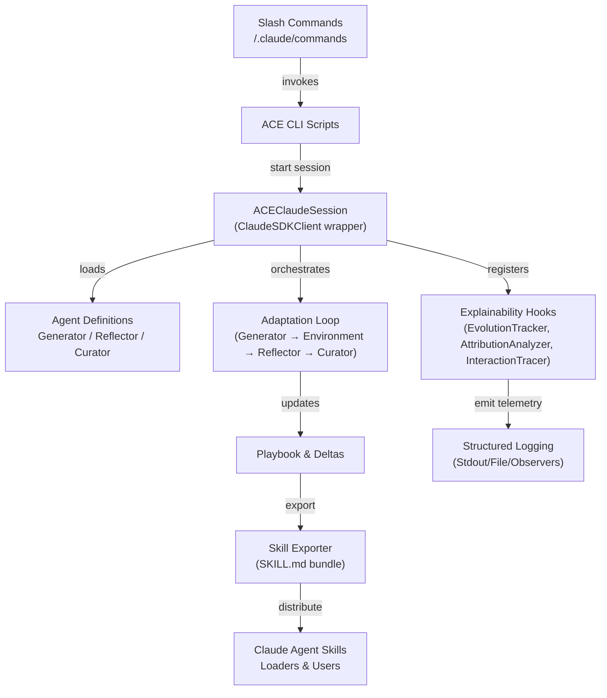

# Claude Agent SDK Integration

The Agentic Context Engine (ACE) now ships with first-class support for the
[Claude Agent SDK](https://docs.claude.com/en/api/agent-sdk/python). The
integration keeps the existing Generator → Reflector → Curator learning loop
intact while introducing Claude-native primitives for orchestration,
observability, and distribution.

## Key Components

- **`ace.claude.session.ACEClaudeSession`** wraps `ClaudeSDKClient` and exposes
  `run_generator`, `run_reflector`, and `run_curator` helpers. When the SDK is
  unavailable it gracefully falls back to the existing LLM clients so legacy
  workloads continue to run.
- **`ace.claude.agents.create_default_agent_definitions`** returns the
  documented `AgentDefinition` payloads for the Generator, Reflector, and
  Curator sub-agents.
- **`ace.claude.hooks.build_explainability_hooks`** binds Claude hook events to
  ACE's `EvolutionTracker`, `AttributionAnalyzer`, and `InteractionTracer` for
  structured logging and analytics.
- **`ace.claude.skills.export_playbook_skill`** packages the evolving playbook
  as a Claude skill folder with a `SKILL.md`, JSON snapshot, and resource docs.

## Architecture Flow



## Slash Commands

The `.claude/commands/` directory defines three documented slash commands:

- `/ace-train` – offline training loop powered by the Claude sub-agents.
- `/ace-evaluate` – evaluation-only workflow to benchmark the current playbook.
- `/ace-playbook` – exports the playbook as a Claude skill bundle.

These commands rely on the standard Claude front-matter schema and invoke the
existing ACE scripts under the hood.

## Exporting Skills

Use the new helper to export the current playbook:

```bash
python scripts/export_playbook_skill.py \
  --playbook trained_playbook.json \
  --output-dir skills/ace-latest \
  --title "ACE Strategy Playbook" \
  --description "Self-improving strategies packaged for Claude sub-agents."
```

The command creates a Claude-compatible folder that can be loaded as a skill in
Claude Code or distributed to collaborators.
